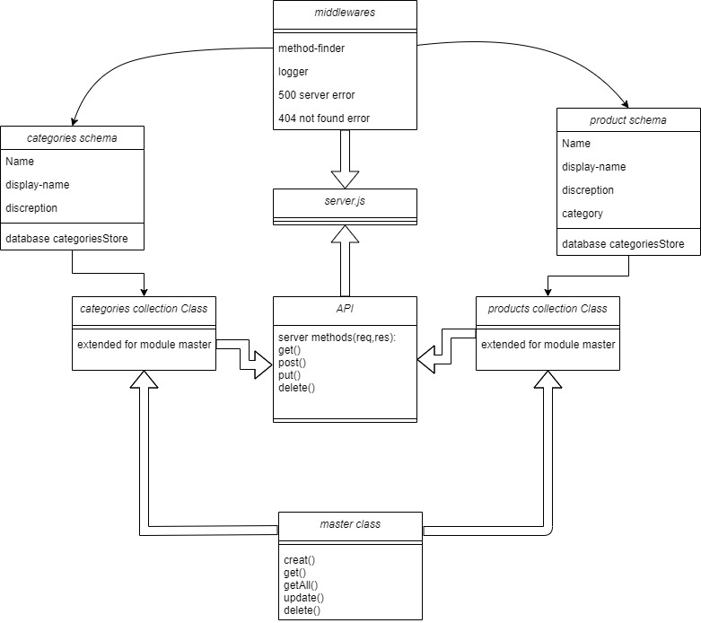

# api-server
An Express/Node.js based server designed to be a “model agnostic” REST API server, which can perform CRUD operations on any data model
- an API to serve data for a virtual storefront, which displays categories and products to a potential shopper.
- the app was connected to Nosql database which is mongoDB
- Support all REST/HTTP methods
1. GET: Retrieve record(s) from a data source
All
One (by id)
Some (by filtering)
1. POST: Create a new record in a data source
1. PUT: Update a single full record in a data source
1. PATCH: Update part of a single record in a data source
1. DELETE: Delete a record in a data source

### data type:
- Categories
name: Type: String, Required
description: Type: String, Required

- Products
name: Type: String, Required
category: Type: String, Required
description: Type: String, Required
price: Type: Number, Required
inStock: Type: Number, Required

## Author: Nedal Erekat

- Here can find the [swagger-Link](https://app.swaggerhub.com/apis/Nedal-Erekat/json-server/0.1#/default/post_products_) 

## UML Diagram of the application’s architecture
